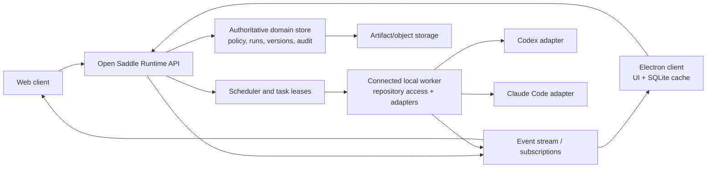

# Open Saddle technical architecture and implementation plan

**Status:** proposed target architecture, grounded in the current repository
**Last updated:** 2026-07-26

This document is the durable technical direction for moving Open Saddle from a
local desktop harness with an optional local control plane to a shared product
with desktop and web clients. It is intentionally an architecture and delivery
plan, not an API compatibility promise.

## Decisions already made

- **Open Saddle Runtime is the authoritative control plane** for projects,
  identity, policies, permission grants, knowledge sources, agents, artifacts,
  versions, runs, audit history, and local-worker registration.
- Electron and web clients use one domain model and one Runtime API. Electron
  adds local repository/filesystem access, a SQLite offline cache, and the
  ability to execute coding runtimes on the user's machine.
- A browser never gains direct access to a user's computer. It can inspect or
  start work that requires a connected local worker; Runtime schedules that
  work to the worker and relays its status and events.
- Permission decisions are made by Runtime and are enforced again at every
  executor boundary. An agent receives only the capabilities needed by its
  leased task.
- Coding runtimes are pluggable adapters. Codex, Claude Code, and future
  runtimes are integrations behind a stable worker-facing contract, not client
  features.

## Current baseline

The repository already provides useful pieces of this direction:

- The React client can use a local or remote HTTP/SSE control plane, while the
  Electron scaffold starts local sidecars and exposes constrained repository
  selection and desktop-runtime information through its preload bridge.
- `packages/control-plane` persists workspace data, grants, runs, runtimes,
  approvals, and route telemetry in SQLite. It has optimistic protection for
  whole-workspace saves, server-side permission checks, run events over SSE,
  and local/Docker provisioning modes.
- The harness registry already discovers CLI providers and maps them to native,
  CLI, or Codex app-server adapters. Existing profiles include `codex` and
  `claude`.
- Browser state currently uses `localStorage` and OPFS; desktop SQLite caching,
  resource-level synchronization, worker registration, and a server-authority
  model do not yet exist.

The current workspace snapshot endpoint and its SQLite rows are a bridge, not
the long-term shared-domain API. Do not make new multi-client behavior depend
on replacing an entire workspace snapshot.

## Target topology



Runtime owns the durable state and authorization decision. A local worker is a
registered execution node, not a peer control plane. Electron may host both a
client and a worker on the same computer, but those roles remain separately
addressable so a browser can use the worker indirectly.

## Domain model and resource conventions

All durable resources have an opaque `id`, `organization_id`, timestamps,
`created_by`, `updated_by`, a monotonic `revision`, and an optional
`deleted_at`. Runtime returns an `ETag` (or revision) for mutable resources;
clients send it with updates. Server-generated IDs, timestamps, revisions, and
audit entries are never accepted as client authority.

| Resource | Runtime-owned responsibility | Important relationships |
| --- | --- | --- |
| Organization, identity, membership | Tenant boundary, authenticated principals, roles/groups | owns projects and policies |
| Project | Shared work boundary and default policy scope | contains sources, agents, runs, artifacts |
| Policy and grant | Declarative authorization rules and scoped exceptions | applies to user, group, agent, worker, source, artifact, or tool |
| Knowledge source | Registered repository, upload, connector, or generated corpus and its indexing state | yields immutable source revisions and artifacts |
| Agent and agent version | Agent definition, configuration, allowed tools, and immutable released versions | a run pins one agent version |
| Artifact and artifact version | Immutable, addressable output/input manifest and content references | produced by runs and may feed later runs |
| Run, attempt, task, and session | User intent, execution attempts, leased work, and interactive event stream | run has one or more attempts; task is assigned to a worker |
| Worker and worker capability | Registered local executor, availability, repository bindings, installed adapter capabilities | accepts only leased tasks |
| Approval and audit event | Human decision and append-only security/operational record | approval is bound to an exact proposed action |

### Versions and resource mutation

Versions are immutable snapshots for agent definitions, knowledge-source
ingestion results, artifacts, and run inputs/outputs. A mutable resource points
to its current version; creating a new version never rewrites a historical run.
Use normal resource updates only for metadata and lifecycle state.

The API should use resource-oriented endpoints under `/v1`, with consistent
envelopes and error codes. For example:

```text
GET/POST  /v1/projects
GET/PATCH /v1/projects/{projectId}
GET/POST  /v1/projects/{projectId}/agents
POST      /v1/agents/{agentId}/versions
GET/POST  /v1/projects/{projectId}/sources
GET/POST  /v1/projects/{projectId}/artifacts
GET/POST  /v1/projects/{projectId}/runs
GET       /v1/runs/{runId}
POST      /v1/runs/{runId}:cancel
GET       /v1/runs/{runId}/events?after={eventId}
GET/POST  /v1/policies and /v1/grants
GET/POST  /v1/approvals
GET        /v1/audit-events
```

`POST /v1/projects/{projectId}/runs` records the requested agent version,
source/artifact versions, requested execution target, requester, and idempotency
key before scheduling. Mutations accept `If-Match`; a stale mutation receives
`409 revision_conflict` with the current representation. Clients must use an
idempotency key for offline writes and run creation.

The event endpoint is an ordered, resumable stream. Events include
`event_id`, `run_id`, `attempt_id`, `sequence`, `occurred_at`, `type`, and a
typed payload. SSE is sufficient initially; a subscription transport can be
added without changing event semantics.

## Local-worker registration and task lifecycle

A local worker is installed with Electron or as a separately managed process.
It is explicitly enrolled into an organization, then maintains an outbound,
authenticated Runtime connection. Runtime never opens an inbound connection to
the user machine.

1. An administrator or user begins enrollment with a short-lived, one-time
   registration token. The worker submits its public identity, host label,
   platform, Electron/worker version, and capability inventory.
2. Runtime creates a `worker` record and returns a renewable, worker-scoped
   credential (prefer mTLS or a device-bound key; do not use a long-lived
   browser token). The worker sends heartbeats and capability changes over an
   outbound stream or long poll.
3. Capabilities describe adapter versions, supported interaction modes,
   repository bindings, OS/architecture, capacity, and declared sandbox
   features. Repository bindings are opaque IDs plus allowed path roots; raw
   paths are shown only to authorized users and are never sent to web clients.
4. A client creates a run with an execution requirement such as
   `target=connected_worker`, `worker_id`, `repository_binding_id`, or a
   capability selector. Runtime authorizes, records, and schedules it. A web
   client receives a normal run ID and event stream, not a machine connection.
5. Runtime creates a short-lived task lease for one eligible worker. The lease
   includes immutable run input references, an authorization/capability grant,
   expiry, and an idempotency token. It contains no reusable user credential.
6. The worker accepts or rejects the lease, starts an attempt, emits normalized
   progress events, creates artifact manifests, and completes, fails, pauses,
   or cancels the task. Lease expiry or worker loss returns the task to
   `waiting_for_worker` or `queued`; Runtime never silently transfers a task to
   a different repository binding.

Recommended state progression:

```text
run: draft -> queued -> waiting_for_worker -> assigned -> running
     -> awaiting_approval | paused | completed | failed | cancelled

task: queued -> leased -> accepted -> executing -> terminal
worker: pending_registration -> online -> degraded -> offline -> revoked
```

An attempt is terminal only after the worker has flushed its last event and
artifact manifests or Runtime has recorded the reason that it could not do so.
Cancellation is cooperative: Runtime marks the run cancellation-requested,
delivers a signed cancel command, and records whether the adapter confirmed it.

## Offline and synchronization model

Electron stores a local SQLite cache containing resource projections, event
cursors, an encrypted credential reference, and an append-only outbox. It may
also retain local repository metadata and selected artifact cache entries. The
local cache accelerates work; Runtime remains authoritative once connected.

| Client state | Meaning | Allowed behavior |
| --- | --- | --- |
| Synced | Local cursor and resource revisions match Runtime | normal reads and writes |
| Pending sync | Local outbox has accepted mutations | show pending status; preserve idempotency keys |
| Offline | Runtime unreachable | read cached data; queue safe draft/metadata changes; do not claim a remote run started |
| Conflict | Runtime rejected a stale or incompatible mutation | preserve both versions and require a focused resolution UI |
| Worker unavailable | A requested worker/repository is offline | allow inspection and queued start; no local fallback without an explicit eligible target |
| Access changed | Policy changed since cache time | invalidate protected projections; re-authorize before any action |

Sync has two directions:

- **Pull:** consume organization/project change events after the stored cursor;
  fetch changed resources by ID/revision; atomically advance the local cursor.
- **Push:** replay the outbox in causal order with idempotency keys and
  `If-Match` revisions. Mark success only after Runtime acknowledgement.

Use last-writer-wins only for explicitly low-risk presentation metadata. Never
auto-merge grants, policies, approvals, run target bindings, agent releases,
or artifact manifests. Those conflicts require refetch and an explicit user or
administrator decision. Local worker execution cannot start from an offline
queue until Runtime grants a valid lease, unless a future policy explicitly
defines an auditable disconnected-execution mode.

## Permission, approval, and audit model

Runtime evaluates each request with the acting user, optional agent version,
resource hierarchy, operation, path/object scope, and current time. Effective
access requires both the initiating user's and the agent's applicable allow;
an explicit deny wins. Worker identity is a separate constraint: it can execute
only a Runtime lease for an allowed repository binding and capability set.

Enforcement occurs at three layers:

1. **Runtime API:** authenticate principal, authorize every resource action,
   create the durable decision/audit record, and issue bounded task leases.
2. **Scheduler/worker:** revalidate lease signature, expiry, repository binding,
   adapter capability, and cancellation/approval state before execution.
3. **Adapter/tool boundary:** apply the task's allowed operations and paths;
   reject out-of-scope filesystem, shell, network, secret, or connector calls.

An approval is a durable, one-time authorization for a specific action. It must
be bound to organization, project, run/attempt, agent version, requester,
action type, affected resource/path or command digest, requested capability,
policy revision, expiry, and approver. On use, Runtime atomically consumes it
and records the decision. A generic project-level approval must not authorize
an unrelated future command.

Audit is append-only and records authentication, policy/grant changes,
authorization decisions, approvals, worker registration/heartbeats/leases,
run state transitions, adapter/tool actions, artifact publication, and export
or deletion actions. Each record includes actor, delegated actor where present,
resource references, correlation/run/attempt IDs, policy revision, outcome,
timestamp, and a redacted reason. Store secrets and raw sensitive tool payloads
outside the audit record; retain hashes or approved redacted summaries instead.

## Artifact model

Artifacts are first-class Runtime resources, not just files attached to a chat.
An artifact version is immutable and has a manifest containing:

- logical name, media type, size, content hash, producing run/attempt, and
  project/organization ownership;
- content location(s) or repository-relative reference, retention policy, and
  sensitivity classification;
- lineage: input source/artifact/agent versions, tool or adapter metadata, and
  verification result;
- access scope and whether content is downloadable, previewable, or only
  available to the bound worker.

Content is stored behind an object/content store or an approved repository
binding. Runtime stores the manifest, authorization, lineage, and lifecycle;
it issues short-lived read/write transfers only after a permission check.
Diffs, logs, patches, generated files, test reports, screenshots, and exported
bundles are all artifact kinds. A local-only artifact remains `local_pending`
until its manifest and permitted content have been published; it cannot be
represented to a web client as globally available before then.

## Pluggable coding-runtime adapters

Workers expose a stable adapter contract independent of a vendor CLI:

```text
discover() -> AdapterCapability
prepare(TaskLease) -> ExecutionHandle
start(ExecutionHandle, EventSink) -> Completion
sendInput(ExecutionHandle, input)
cancel(ExecutionHandle)
collectArtifacts(ExecutionHandle) -> ArtifactManifest[]
cleanup(ExecutionHandle)
```

`AdapterCapability` declares adapter ID/version, protocol, supported models,
streaming and interactive-input support, cancellation semantics, required
approval modes, sandbox support, and known limitations. Runtime selects only
registered, policy-allowed capabilities; the UI may present a friendly provider
choice but must not invoke a local binary itself.

- **Codex:** prefer the app-server/structured protocol when available to retain
  rich events, session attachment, and interactive behavior. A CLI fallback
  can still normalize output into Runtime events.
- **Claude Code:** use a CLI adapter with explicit declared shell/permission
  behavior. The existing shell-capable approval policy becomes a capability
  requirement enforced by the lease.
- **Other adapters:** native Open Saddle coding, Cursor, Gemini, OpenCode, and
  custom profiles can share the same contract. Profiles are administrator
  configured and allowlisted; arbitrary executable/path submission is not part
  of the public API.

Adapters translate vendor output to Open Saddle event types such as
`attempt.started`, `output.delta`, `tool.requested`, `tool.completed`,
`approval.requested`, `artifact.created`, `verification.completed`, and
`attempt.completed`. Preserve the original provider event as an optionally
retained, redacted diagnostic payload, but never make client behavior depend on
vendor-specific events.

## Focused client interface

The shared client interface is project, agent, run, artifact, and approval
oriented. It should show execution target in plain language—such as “MacBook
worker · repository: api”—and show `waiting for worker`, lease, approval, and
sync state inside a run detail view. It should not become a worker fleet
console by default.

Electron adds a repository picker, worker connectivity, local-cache health,
and local-run controls only where needed. The web client can select an
authorized connected worker/repository binding, start a run, attach to its
event stream, approve eligible actions, and inspect published artifacts. It
cannot browse arbitrary local paths, issue OS commands, or receive worker
credentials.

## Phased implementation roadmap

### Phase 1 — connect the offline desktop harness to Runtime

**Goal:** replace the implicit same-process desktop/control-plane relationship
with an authenticated Runtime client while retaining the existing focused UI.

- Define `/v1` envelopes, IDs, revisions, idempotency, run events, and an
  Electron SQLite cache/outbox schema. Keep existing endpoints as a temporary
  compatibility layer.
- Make Electron authenticate to Runtime, pull projects/runs/permissions, and
  show explicit connection and sync states. Migrate desktop data from browser
  cache/snapshot storage without treating it as authoritative after import.
- Move desktop-originated run creation and SSE reconnection onto the new API.
  Existing local sidecars may remain the initial Runtime deployment target.
- Add audit events for client authentication, sync mutation, run creation, and
  authorization decisions.

**Exit criteria:** a desktop user can work with a Runtime-backed project, lose
connectivity without data loss, reconnect idempotently, and see a run resume
from its event cursor. No application feature requires a whole-workspace PUT.

### Phase 2 — shared workspace and web client

**Goal:** make Runtime the shared system of record for desktop and web users.

- Replace snapshot-centric workspace persistence with resource APIs for
  projects, sources, agents/versions, artifacts, runs, grants, approvals, and
  audit history.
- Add organization identity/membership, revision-based conflict handling,
  project-scoped event subscriptions, and policy invalidation.
- Build the web experience from the shared data/API model; keep native file and
  execution affordances capability-gated to Electron.
- Publish artifacts through manifests and authorized transfers, with lineage in
  run detail views.

**Exit criteria:** web and Electron see the same project/run/approval history;
a web user can inspect and start an eligible run without direct filesystem
access; permission and approval decisions are server-authoritative and
auditable.

### Phase 3 — local worker and adapter integration

**Goal:** execute web-initiated or desktop-initiated work safely on a connected
local computer.

- Extract the Electron execution surface into a worker service and implement
  enrollment, worker credentials, capability discovery, outbound heartbeat,
  repository bindings, task leases, and cancellation.
- Introduce the adapter contract and migrate the existing Codex app-server,
  CLI, native Open Saddle, and Claude Code harnesses behind it.
- Implement scheduler eligibility, worker-loss recovery, lease expiry,
  normalized events, artifact collection, and bounded approval leases.
- Add an intentionally small worker-management surface for registration,
  availability, and revocation; retain run detail as the main user workflow.

**Exit criteria:** a web-created run can be explicitly scheduled to an online
local worker, execute through an allowlisted adapter, stream events back through
Runtime, and produce access-controlled artifacts with a complete audit trail.

### Phase 4 — production hardening and scale

**Goal:** make shared execution operable beyond a single local SQLite daemon.

- Move the Runtime store behind a production database and shared event bus;
  preserve the domain/API contract and retain SQLite only for desktop cache or
  local development.
- Add device-key rotation/revocation, attestation policy where appropriate,
  encrypted cache handling, retention/deletion workflows, audit export, and
  observability for worker/scheduler health.
- Test recovery paths: duplicate outbox delivery, stale lease, worker crash,
  Runtime restart, policy revocation during a run, failed artifact upload, and
  adapter protocol change.

## Unresolved decisions

The following must remain explicit product/security decisions before their
respective phase, rather than being silently encoded in a client or adapter:

1. **Identity provider and tenant model:** OIDC details, group synchronization,
   service-account rules, and whether an organization can span multiple
   Runtime deployments.
2. **Worker trust level:** whether device attestation is required, which roles
   may enroll/revoke a worker, and the credential/key-rotation design.
3. **Repository binding semantics:** whether a binding is a fixed checkout,
   can permit a branch/worktree, and how Runtime verifies a requested revision
   without exposing source contents to the server.
4. **Disconnected execution:** the default in this document is “no Runtime
   lease, no execution.” Any exception needs its own policy, reconciliation,
   and audit design.
5. **Artifact storage and retention:** object-store choice, encryption keys,
   data residency, large artifact handling, and deletion/legal-hold rules.
6. **Approval granularity:** the exact digest/context required for shell,
   network, write, connector, and publish actions, plus who may approve each.
7. **Scheduling policy:** default user choice versus automatic selection among
   eligible workers, concurrency/cost limits, and whether organization-managed
   remote workers share this protocol.
